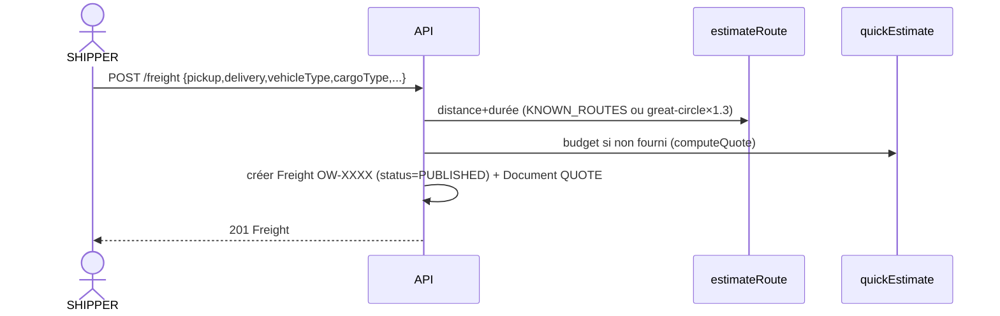
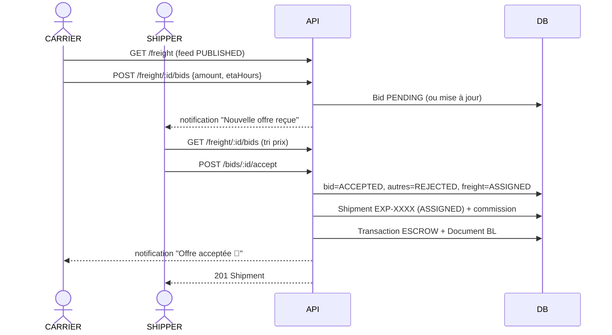
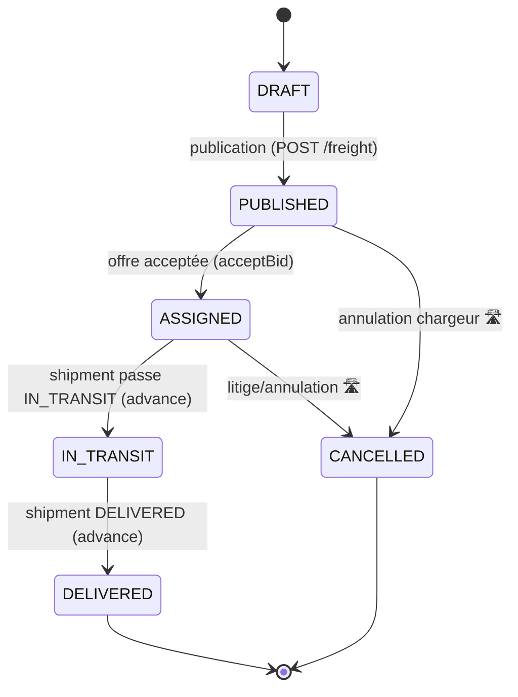
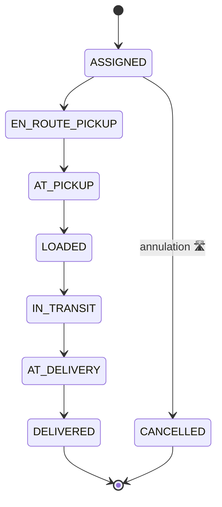
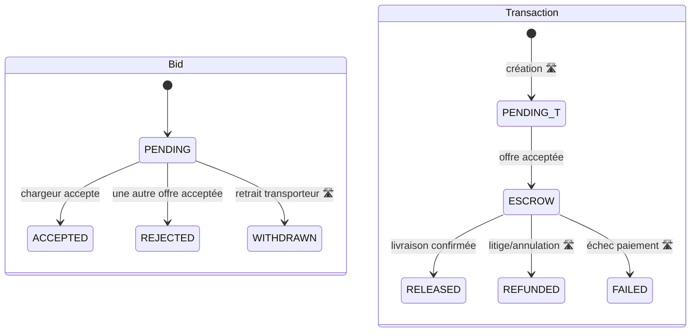

# ONE WAY — Parcours utilisateurs (User Flows)

> Parcours mobile-first, diagrammes ASCII + Mermaid, wireframes textuels et
> machines à états basées sur les **enums réels** du code
> (`src/lib/types.ts`, `prisma/schema.prisma`).

---

## 1. Vue d'ensemble : chargeur → transporteur → livraison → paiement

```
┌──────────────┐    ┌──────────────┐    ┌──────────────┐    ┌──────────────┐    ┌──────────────┐
│  INSCRIPTION │ →  │  PUBLICATION │ →  │   MATCHING   │ →  │    SUIVI     │ →  │   PAIEMENT   │
│   & KYC      │    │   DE FRET    │    │ & ENCHÈRES   │    │  TEMPS RÉEL  │    │ & NOTATION   │
└──────────────┘    └──────────────┘    └──────────────┘    └──────────────┘    └──────────────┘
   SHIPPER /          SHIPPER             CARRIER bid →        DRIVER advance      ESCROW→RELEASED
   CARRIER            POST /freight       SHIPPER accept       POST .../advance    + reviews
   ADMIN (KYC)        OW-XXXX             EXP-XXXX             tracking events     PAY-XXXX
```

### Diagramme Mermaid — flux global

```mermaid
flowchart LR
    A[Inscription SHIPPER/CARRIER] --> B{KYC vérifié ?}
    B -- Non --> B1[ADMIN valide KYC<br/>PATCH /admin/kyc/:id]
    B1 --> C
    B -- Oui --> C[Chargeur publie un fret<br/>POST /freight → OW-XXXX]
    C --> D[Devis auto + estimation route<br/>quickEstimate / estimateRoute]
    D --> E{Mode de prix}
    E -- FIXED --> F[Transporteurs candidatent<br/>POST /freight/:id/bids]
    E -- AUCTION --> F
    C --> G[Matching intelligent<br/>GET /freight/:id/match]
    G --> F
    F --> H[Chargeur compare les offres<br/>GET /freight/:id/bids tri prix]
    H --> I[Chargeur accepte<br/>POST /bids/:id/accept → EXP-XXXX]
    I --> J[Expédition ASSIGNED<br/>Transaction ESCROW + BL]
    J --> K[Chauffeur fait avancer<br/>POST /shipments/:id/advance]
    K --> L{Statut}
    L -- DELIVERED --> M[POD + Facture<br/>Transaction RELEASED]
    M --> N[Notation bilatérale<br/>POST /reviews]
```



---

## 2. Parcours 1 — Inscription & KYC

### ASCII

```
Visiteur
  │ ouvre l'app, choisit "Je suis chargeur" ou "Je suis transporteur"
  ▼
[Écran inscription] ── POST /api/auth/register ──► 201 + cookie session (7 j)
  │ (email unique, mot de passe ≥ 6, bcrypt)            kycStatus = NONE
  ▼
[Tableau de bord]
  │ (transporteur) téléverse pièces KYC → kycStatus = PENDING        🛣️
  ▼
ADMIN ── PATCH /api/admin/kyc/:id {status:"VERIFIED"} ──► kycStatus = VERIFIED
```

### Mermaid — séquence

```mermaid
sequenceDiagram
    actor U as Utilisateur
    participant API as API ONE WAY
    participant DB as Base de données
    participant A as ADMIN
    U->>API: POST /auth/register {role,email,phone,password}
    API->>DB: créer User (kycStatus=NONE, bcrypt)
    API-->>U: 201 PublicUser + cookie oneway_session
    U->>API: (transporteur) upload docs KYC 🛣️
    API->>DB: KycDocument(status=PENDING) ; User.kycStatus=PENDING
    A->>API: PATCH /admin/kyc/:id {status:"VERIFIED"}
    API->>DB: doc.status=VERIFIED ; recalcul User.kycStatus
    API-->>A: 200 document mis à jour
```

---

## 3. Parcours 2 — Publication de fret (3 étapes)

### Mermaid — séquence



### Wireframe mobile — création d'annonce en 3 étapes

```
┌───────────────────────────────┐   ┌───────────────────────────────┐   ┌───────────────────────────────┐
│ ← Nouveau fret      Étape 1/3 │   │ ← Nouveau fret      Étape 2/3 │   │ ← Nouveau fret      Étape 3/3 │
├───────────────────────────────┤   ├───────────────────────────────┤   ├───────────────────────────────┤
│ TRAJET                        │   │ MARCHANDISE                   │   │ PRIX & PUBLICATION            │
│                               │   │                               │   │                               │
│ 📍 Enlèvement                 │   │ Titre  [_________________]    │   │ Mode :  (●) Prix fixe         │
│  Ville [Antananarivo    ▼]    │   │ Type   [📦 Générales     ▼]   │   │         ( ) Enchère           │
│  Adr.  [_______________]      │   │ Poids  [____] kg              │   │                               │
│                               │   │ Volume [____] m³ (option)     │   │ Budget [ 1 250 000 ] Ar       │
│ 🏁 Livraison                  │   │ Valeur [________] Ar          │   │  └─ estimé auto si vide       │
│  Ville [Toamasina       ▼]    │   │ ☐ Assurance (0,5 %)           │   │                               │
│  Adr.  [_______________]      │   │ 📷 Ajouter des photos         │   │ Urgence (●)Std ( )Exp ( )Flex │
│                               │   │                               │   │                               │
│ 📅 Date  [JJ/MM/AAAA]         │   │ 🚚 Véhicule suggéré :         │   │ Devis estimé : 1 287 400 Ar   │
│ 🚚 Véhicule [Camion 3T  ▼]    │   │   Camion 3T (≥ poids)         │   │ Distance : 357 km · 5,5 h     │
│                               │   │                               │   │                               │
│ Distance estimée : 357 km     │   │                               │   │ [    Publier l'annonce    ]   │
│ [        Suivant →        ]   │   │ [        Suivant →        ]   │   │                               │
└───────────────────────────────┘   └───────────────────────────────┘   └───────────────────────────────┘
```

### Wireframe — écran d'accueil chargeur

```
┌───────────────────────────────┐
│ ONE WAY            🔔3   👤    │
├───────────────────────────────┤
│  Bonjour Rina 👋              │
│  ┌─────────────────────────┐  │
│  │  +  Publier un fret     │  │  ← CTA principal
│  └─────────────────────────┘  │
│                               │
│  MES FRETS                    │
│  ┌─────────────────────────┐  │
│  │ OW-0042 · Tana→Toamasina│  │
│  │ PUBLISHED · 3 offres 🔵 │  │
│  ├─────────────────────────┤  │
│  │ OW-0039 · Tana→Antsirabe│  │
│  │ IN_TRANSIT · 🚚 64%     │  │
│  ├─────────────────────────┤  │
│  │ EXP-0007 · DELIVERED ✅ │  │
│  │ Noter le transporteur ⭐│  │
│  └─────────────────────────┘  │
│ [ Accueil ][ Frets ][ Suivi ] │
└───────────────────────────────┘
```

---

## 4. Parcours 3 — Matching, enchères & acceptation

### ASCII

```
SHIPPER ── GET /freight/:id/match ──► top 5 transporteurs (score)
                                       ▲
CARRIER ── GET /freight (feed PUBLISHED) ──► voit l'annonce
   │
   └─ POST /freight/:id/bids {amount, etaHours, message, vehicleId}
        │  (offre PENDING ; mise à jour si déjà candidat)
        ▼
   notif chargeur "Nouvelle offre reçue"
        │
SHIPPER ── GET /freight/:id/bids (tri prix croissant) ──► compare
   │
   └─ POST /bids/:id/accept
        ├─ bid → ACCEPTED ; autres → REJECTED
        ├─ freight → ASSIGNED
        ├─ Shipment EXP-XXXX (status ASSIGNED)
        ├─ commission = amount × (8% Premium | 12%)
        ├─ Transaction ESCROW (méthode MVOLA)
        ├─ affecte chauffeur AVAILABLE → ON_MISSION
        └─ Document BL + notif transporteur "Offre acceptée 🎉"
```

### Mermaid — séquence enchère/acceptation



### Wireframe — feed transporteur

```
┌───────────────────────────────┐
│ Fret disponible      🔍  ⚙️   │
├───────────────────────────────┤
│ Filtres: [Camion 3T][Tana ✕] │
│ ┌─────────────────────────┐   │
│ │ OW-0042                 │   │
│ │ Antananarivo → Toamasina│   │
│ │ 📦 Générales · 2 400 kg │   │
│ │ 🚚 Camion 3T · 357 km   │   │
│ │ Budget : 1 287 400 Ar   │   │
│ │ ⏱ Départ : 02/07        │   │
│ │ [  Faire une offre  ]   │   │
│ ├─────────────────────────┤   │
│ │ OW-0041 · Tana→Mahajanga│   │
│ │ Budget : 2 100 000 Ar   │   │
│ │ [  Faire une offre  ]   │   │
│ └─────────────────────────┘   │
│ [ Fret ][ Missions ][ Flotte ]│
└───────────────────────────────┘
```

---

## 5. Parcours 4 — Suivi temps réel & livraison

### ASCII

```
DRIVER (app chauffeur) ── POST /shipments/:id/advance ──► statut suivant
   │                                                       + TrackingEvent
   │  ASSIGNED → EN_ROUTE_PICKUP → AT_PICKUP → LOADED
   │          → IN_TRANSIT → AT_DELIVERY → DELIVERED
   │  (progress 0→1, position interpolée lerpPoint)
   ▼
SHIPPER ── notif "Suivi EXP-XXXX" ──► carte live + timeline
   │
DELIVERED :
   ├─ progress = 1, deliveredAt set
   ├─ Transaction ESCROW → RELEASED
   ├─ chauffeur → AVAILABLE
   └─ Documents POD + INVOICE générés
```

### Wireframe — suivi live (chargeur)

```
┌───────────────────────────────┐
│ ← Suivi  EXP-0042             │
├───────────────────────────────┤
│   ╔═══════════════════════╗   │
│   ║   [ carte SVG MG ]    ║   │
│   ║  📍───🚚────────🏁    ║   │  ← position interpolée
│   ╚═══════════════════════╝   │
│  En transit · 64 %            │
│  Code suivi : OW7F3K2A        │
├───────────────────────────────┤
│  ● Mission attribuée   10:02  │
│  ● En route chargement 10:40  │
│  ● Chargement terminé  11:15  │
│  ● En transit ▶︎       11:30  │
│  ○ Arrivée livraison          │
│  ○ Livré                      │
├───────────────────────────────┤
│  Transporteur : Faly Transit  │
│  ⭐ 4,7 (32) · 📞 Appeler 💬  │
└───────────────────────────────┘
```

### Wireframe — app chauffeur

```
┌───────────────────────────────┐
│ Ma mission         👤 Tojo    │
├───────────────────────────────┤
│ EXP-0042 · 2 400 kg           │
│ Antananarivo → Toamasina      │
│ 357 km · ~5,5 h               │
├───────────────────────────────┤
│ ÉTAPE ACTUELLE : EN_ROUTE     │
│                               │
│ [ ✓ Arrivé au chargement ]    │  ← AT_PICKUP
│ [   Chargement terminé    ]   │  ← LOADED
│ [   Démarrer le transit   ]   │  ← IN_TRANSIT
│ [   Arrivé livraison      ]   │  ← AT_DELIVERY
│ [ 📷 Confirmer livraison  ]   │  ← DELIVERED + POD photo
│                               │
│ 🧭 Itinéraire   📞 Chargeur   │
└───────────────────────────────┘
```

---

## 6. Machine à états — FREIGHT (`FreightStatus`)

Enum source : `src/lib/types.ts` / `prisma/schema.prisma`.



| Transition | Déclencheur (code) |
|------------|--------------------|
| `DRAFT → PUBLISHED` | Création via `POST /freight` (statut initial `PUBLISHED`). |
| `PUBLISHED → ASSIGNED` | `acceptBid()` lors de `POST /bids/:id/accept`. |
| `ASSIGNED → IN_TRANSIT` | `advanceShipment()` quand le shipment atteint `IN_TRANSIT`. |
| `IN_TRANSIT → DELIVERED` | `advanceShipment()` quand le shipment atteint `DELIVERED`. |
| `→ CANCELLED` | Annulation (roadmap). |

> Note : le statut `DRAFT` existe dans l'enum mais l'API crée directement en `PUBLISHED` (les brouillons sont une évolution prévue).

---

## 7. Machine à états — SHIPMENT (`ShipmentStatus`)

Flux ordonné `STATUS_FLOW` dans `src/lib/services.ts`.



| Statut | Progress | Effets de bord (code) |
|--------|---------:|-----------------------|
| `ASSIGNED` | 0 | Création shipment, transaction `ESCROW`, document `BL`, 1er `TrackingEvent`. |
| `EN_ROUTE_PICKUP` | ~0,17 | Position interpolée, événement, notif chargeur. |
| `AT_PICKUP` | ~0,33 | idem. |
| `LOADED` | ~0,50 | idem. |
| `IN_TRANSIT` | ~0,67 | Met aussi le **fret** en `IN_TRANSIT`. |
| `AT_DELIVERY` | ~0,83 | idem. |
| `DELIVERED` | 1 | `deliveredAt`, transaction → `RELEASED`, chauffeur → `AVAILABLE`, fret → `DELIVERED`, documents `POD` + `INVOICE`. |
| `CANCELLED` | — | Annulation (roadmap). |

---

## 8. Machine à états — BID (`BidStatus`) & TRANSACTION (`TxStatus`)



> Aujourd'hui, la transaction est créée directement en `ESCROW` à l'acceptation (méthode `MVOLA` par défaut), puis passe `RELEASED` à la livraison. Les états `PENDING`, `REFUNDED`, `FAILED` sont prévus avec l'intégration des PSP (cf. `06-api.md` et `04-architecture.md`).
