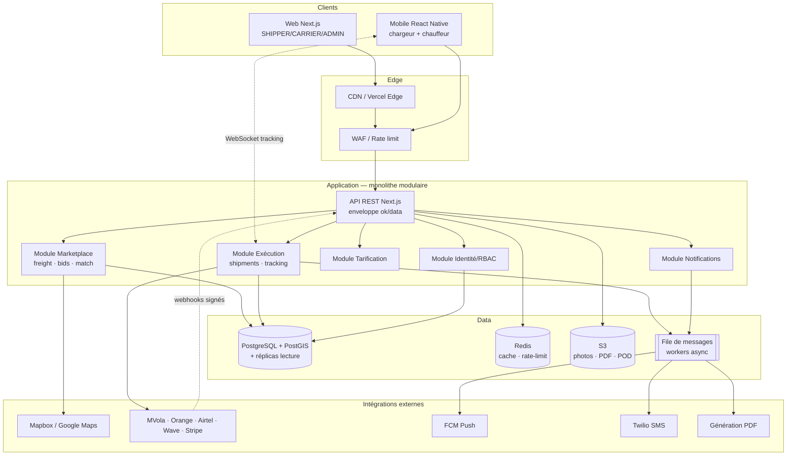
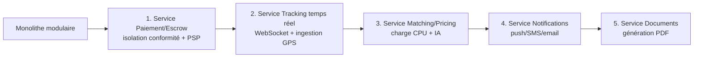

# ONE WAY — Architecture technique

> MVP : **monolithe modulaire** Next.js (App Router) + couche de données
> commutable (JSON en dev → PostgreSQL/Prisma en prod). Chemin d'évolution
> documenté vers des **microservices** ciblés.

---

## 1. Principe directeur : monolithe modulaire d'abord

Pour un MVP de marketplace, la **liquidité** (assez de chargeurs ET de transporteurs) prime sur la sophistication technique. On optimise donc pour la **vitesse d'itération** et le **faible coût opérationnel**, pas pour une scalabilité prématurée.

### Pourquoi un monolithe modulaire (et pas des microservices d'emblée)

| Critère | Monolithe modulaire (choisi) | Microservices (prématuré au MVP) |
|---------|------------------------------|----------------------------------|
| Vitesse de livraison | ✅ Très rapide, un seul déploiement | ❌ Orchestration, contrats inter-services |
| Coût infra | ✅ Minimal (1 app + 1 DB) | ❌ Multiples runtimes, réseau, observabilité |
| Transactions | ✅ Cohérence forte locale (1 DB) | ❌ Sagas, cohérence éventuelle |
| Recrutement / équipe réduite | ✅ Adapté | ❌ Surdimensionné |
| Pivots produit | ✅ Refactor simple | ❌ Coûteux |

La modularité est **déjà présente dans le code** : la logique métier est isolée en modules (`src/lib/services.ts`, `pricing.ts`, `geo.ts`, `auth.ts`, `db.ts`), l'API REST forme une frontière nette, et la couche de données est commutable. Ces **frontières de modules** deviendront, le moment venu, des **frontières de services**.

### Découpage en modules (aujourd'hui)

```
src/
├── app/api/            ← frontière HTTP (route handlers)
│   ├── auth/           ← module Identité
│   ├── quote/          ← module Tarification (public)
│   ├── freight/        ← module Marketplace (annonces, bids, match)
│   ├── bids/           ← module Marketplace (acceptation)
│   ├── shipments/      ← module Exécution (tracking)
│   ├── notifications/  ← module Notifications
│   ├── reviews/        ← module Confiance
│   └── admin/          ← module Back-office
├── lib/
│   ├── auth.ts         ← Identité & RBAC (JWT, bcrypt, requireRole)
│   ├── services.ts     ← cœur métier (placeBid, acceptBid, advanceShipment, matchCarriers)
│   ├── pricing.ts      ← moteur de prix
│   ├── geo.ts          ← géo (gazetteer, routes, distances)
│   ├── db.ts           ← couche données commutable (JSON ⇄ Prisma)
│   ├── validation.ts   ← schémas Zod (contrats d'entrée)
│   └── api.ts          ← enveloppe { ok, data } / { ok, error }
└── data/catalog.ts     ← paramètres commerciaux (véhicules, coeffs, plans, commission)
```

---

## 2. Stack technique recommandée

| Couche | MVP (actuel) | Production / cible |
|--------|--------------|--------------------|
| **Web** | Next.js (App Router) + TypeScript, React Server Components | idem, déployé sur Vercel ou conteneur |
| **Mobile** | (web responsive mobile-first) | **React Native / Expo** (chargeur + chauffeur), partage des types TS |
| **Backend / API** | Route handlers Next.js (REST, enveloppe `{ok,data}`) | idem, extraction progressive de services |
| **Base de données** | Couche JSON (`src/lib/db.ts`), zéro dépendance | **PostgreSQL + PostGIS** (Neon / Supabase / RDS) via **Prisma** |
| **Cache / files** | — | **Redis** (cache, rate-limit, sessions chaudes), **file de messages** (BullMQ/Redis ou SQS/RabbitMQ) |
| **Temps réel** | Polling / interpolation simulée | **WebSocket / SSE** pour le tracking live ; ingestion GPS |
| **Stockage fichiers** | — | **S3** (photos fret, POD, documents PDF) |
| **Auth** | JWT (jose) en cookie `httpOnly`, bcrypt | idem + rotation des secrets, MFA admin |
| **Cloud** | Local / Vercel | AWS / GCP ou PaaS (Vercel + Neon + Upstash) selon coût |

### Compatibilité de la transition DB

Le commentaire en tête de `prisma/schema.prisma` formalise le contrat : **l'API ne change pas**. On remplace l'implémentation de `src/lib/db.ts` par un client Prisma ; les services (`acceptBid`, `advanceShipment`...) et les route handlers restent identiques. Voir `05-database.md`.

---

## 3. Intégrations indispensables

| Domaine | Service | Usage | Statut |
|---------|---------|-------|--------|
| **Cartographie & routing** | Mapbox / Google Maps Directions | Distances/durées réelles, géométrie route, géocodage | 🛣️ stub `src/lib/integrations/maps.ts` ; MVP = `estimateRoute` (gazetteer + great-circle) |
| **Géoloc temps réel** | SDK GPS app chauffeur + ingestion WebSocket | Position live de l'expédition | 🛣️ ; MVP = interpolation `lerpPoint` |
| **Paiement mobile money** | **MVola, Orange Money, Airtel Money, Wave** | Encaissement, séquestre, versement transporteur | 🛣️ ; modélisé (`PaymentMethod`, `TxStatus`) |
| **Paiement carte/international** | **Stripe** | Cartes, expansion Europe | 🛣️ |
| **Webhooks paiement** | Endpoints signés | Confirmation asynchrone (ESCROW/RELEASED/FAILED) | 🛣️ (cf. `06-api.md`) |
| **Génération PDF** | Service de rendu (devis, BL, facture, POD) | Documents téléchargeables | 🛣️ ; documents modélisés (`DocumentRecord`) |
| **Push notifications** | **Firebase Cloud Messaging (FCM)** | Alertes mobile (offre, mission, suivi) | 🛣️ ; notifications in-app ✅ |
| **SMS** | **Twilio** (ou agrégateur local) | OTP, alertes sans data, code de suivi | 🛣️ |
| **Email transactionnel** | Postmark / SES | Reçus, factures, KYC | 🛣️ |

---

## 4. Sécurité & conformité

### 4.1 Authentification & sessions
- Mot de passe **haché bcrypt** (coût 10) — `src/lib/auth.ts`.
- Session **JWT signé HS256** (`jose`), porté par un cookie `oneway_session` **`httpOnly`, `sameSite=lax`, `secure` en prod**, durée 7 jours.
- Secret via `AUTH_SECRET` (à provisionner hors code en prod ; rotation prévue).

### 4.2 RBAC (contrôle d'accès par rôle)
- 4 rôles : `SHIPPER`, `CARRIER`, `DRIVER`, `ADMIN`.
- Gardes serveur : `requireUser()` (401 si non authentifié), `requireRole(...roles)` (403 si rôle insuffisant).
- Contrôles d'objet : ex. seul le **propriétaire du fret** accepte une offre ; seul le **transporteur/chauffeur assigné ou admin** fait avancer une expédition.

### 4.3 Validation des entrées
- **Zod** sur tous les corps de requête (`src/lib/validation.ts`) → erreurs `422` structurées (`issues`).

### 4.4 RGPD & protection des données
- Minimisation : `passwordHash` jamais exposé (`toPublicUser`).
- Droits des personnes (accès, rectification, effacement) : à implémenter côté back-office (roadmap).
- Données KYC (pièces d'identité) : stockage chiffré, accès restreint admin, durée de conservation limitée.
- Journalisation des accès aux données sensibles (audit log) — roadmap.

### 4.5 Chiffrement
- **En transit** : HTTPS/TLS partout ; cookies `secure` en prod.
- **Au repos** : chiffrement disque DB managée (Neon/Supabase/RDS), buckets S3 chiffrés (SSE), secrets dans un gestionnaire (Vault / AWS Secrets Manager).

### 4.6 KYC
- Vérification documentaire (ID, permis, carte grise, assurance, registre du commerce) avant d'opérer.
- Workflow admin `PATCH /admin/kyc/:id` ; synchronisation du `kycStatus` utilisateur.

### 4.7 Séquestre des paiements (escrow)
- Les fonds passent en `ESCROW` à l'acceptation, `RELEASED` à la livraison confirmée (POD).
- En prod : compte de cantonnement / partenaire PSP, réconciliation, gestion `REFUNDED`/`FAILED` et litiges.

### 4.8 Durcissement (roadmap)
- Rate-limiting (Redis) sur auth & devis, protection anti-bruteforce.
- MFA pour les comptes `ADMIN`.
- Webhooks PSP signés et idempotents.

---

## 5. Scalabilité & performance

Objectif : servir **des milliers d'utilisateurs simultanés** sur le marché malgache puis multi-pays.

### 5.1 Lecture / écriture
- Index DB déjà déclarés (`schema.prisma`) : `User(role, city)`, `Freight(status, shipperId, vehicleType)`, `Shipment(carrierId, shipperId, status)`, `Bid(freightId)`, etc.
- **Réplicas en lecture** pour le feed de fret (forte lecture) ; écritures sur le primaire.

### 5.2 Mise en cache (Redis)
- Cache du **feed de fret** filtré, des **résultats de matching** et des **estimations de route/devis** (entrées déterministes).
- Cache des sessions chaudes et des catalogues (`VEHICLE_TYPES`, `CARGO_TYPES`).

### 5.3 Temps réel (tracking)
- **WebSocket / SSE** pour pousser les `TrackingEvent` et positions ; fan-out par expédition.
- Ingestion GPS asynchrone via la **file de messages**, agrégation avant push pour limiter la charge.

### 5.4 Travaux asynchrones (file de messages)
- Notifications (push FCM, SMS, email), génération de PDF, recalcul de score de matching, réconciliation paiements, recompute des notes — déportés en workers.

### 5.5 Partitionnement géographique
- Données et trafic naturellement segmentables par **pays/région** (`City.country`, `User.city`).
- Sharding ou partitionnement par pays à l'expansion ; CDN d'assets ; régions cloud proches des utilisateurs.

### 5.6 Frontend
- React Server Components + streaming, payloads légers (mobile-first, réseaux contraints), carte SVG légère en fallback.

---

## 6. Diagramme d'architecture (cible production)



---

## 7. Chemin d'évolution vers les microservices

On extrait un service **uniquement** lorsqu'un module a un besoin propre (scalabilité, isolation de panne, équipe dédiée, contrainte de conformité). Ordre d'extraction recommandé :



| Service cible | Pourquoi l'extraire | Frontière actuelle |
|---------------|---------------------|--------------------|
| **Paiement / Escrow** | Conformité financière, isolation, intégrations PSP multiples, idempotence webhooks | `Transaction`, méthodes/statuts |
| **Tracking temps réel** | Connexions persistantes (WebSocket), pics GPS, profil de charge différent | `advanceShipment`, `TrackingEvent` |
| **Matching / Pricing** | Charge CPU, futurs modèles IA (prévision de prix, matching) | `matchCarriers`, `computeQuote` |
| **Notifications** | Débit élevé, intégrations externes, retries | `notify`, `Notification` |
| **Documents** | Génération PDF lourde, asynchrone | `DocumentRecord` |

> L'API REST stable et les schémas Zod servent de **contrats** : l'extraction se fait derrière la même interface, sans casser les clients.
