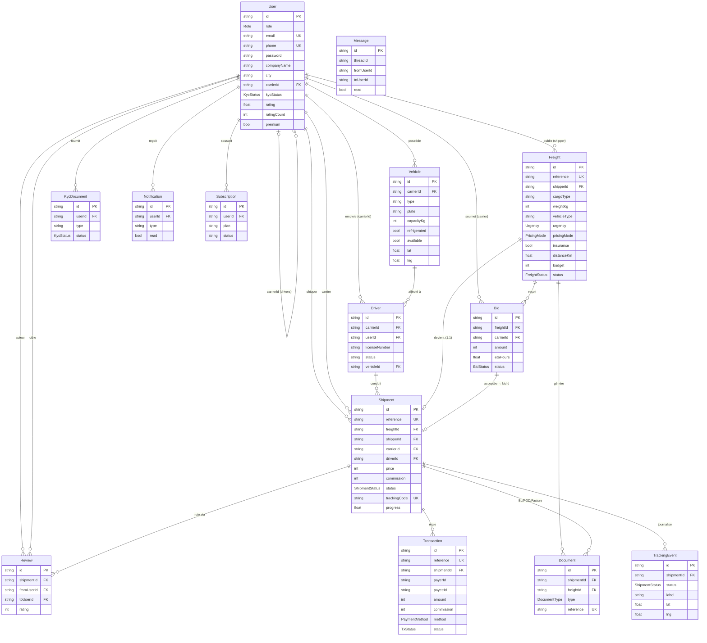

# ONE WAY — Base de données

> Schéma cohérent avec `prisma/schema.prisma` (canonique production) et
> `src/lib/types.ts` (types runtime). Devise des montants : **Ariary (MGA)**,
> stockés en entiers (`Int`).

---

## 1. Diagramme entité-association (erDiagram)



> `Message` n'a pas de relation Prisma explicite (clé applicative `threadId` = `freightId` ou `shipmentId`) — c'est volontaire (fil léger, indexé sur `threadId`).

---

## 2. Énumérations

| Enum | Valeurs |
|------|---------|
| `Role` | `SHIPPER`, `CARRIER`, `DRIVER`, `ADMIN` |
| `KycStatus` | `NONE`, `PENDING`, `VERIFIED`, `REJECTED` |
| `FreightStatus` | `DRAFT`, `PUBLISHED`, `ASSIGNED`, `IN_TRANSIT`, `DELIVERED`, `CANCELLED` |
| `PricingMode` | `FIXED`, `AUCTION` |
| `Urgency` | `STANDARD`, `EXPRESS`, `FLEXIBLE` |
| `BidStatus` | `PENDING`, `ACCEPTED`, `REJECTED`, `WITHDRAWN` |
| `ShipmentStatus` | `ASSIGNED`, `EN_ROUTE_PICKUP`, `AT_PICKUP`, `LOADED`, `IN_TRANSIT`, `AT_DELIVERY`, `DELIVERED`, `CANCELLED` |
| `DocumentType` | `QUOTE`, `BL`, `INVOICE`, `POD`, `CERTIFICATE` |
| `PaymentMethod` | `MVOLA`, `ORANGE_MONEY`, `AIRTEL_MONEY`, `WAVE`, `CARD`, `TRANSFER`, `CASH` |
| `TxStatus` | `PENDING`, `ESCROW`, `RELEASED`, `REFUNDED`, `FAILED` |

> `Vehicle.type`, `Freight.cargoType`/`vehicleType`, `Driver.status`, `Subscription.plan` sont des `String` côté DB mais contraints côté application par les clés du catalogue (`VehicleTypeKey`, `CargoTypeKey`) et la validation Zod.

---

## 3. Description des tables clés

### `User`
Compte unique pour tous les rôles.
- **Champs clés** : `email` (unique), `phone` (unique), `password` (hash bcrypt — exposé en `passwordHash` côté type runtime, jamais renvoyé via API), `role`, `kycStatus`, `rating`/`ratingCount` (note moyenne recalculée à chaque avis), `premium` (commission réduite 8 %).
- **Auto-relation** : `carrierId` rattache un `DRIVER` à son transporteur (`CarrierDrivers`).
- **Index** : `role`, `city` — accélèrent le matching et les filtres géographiques.

### `Vehicle`
Flotte d'un transporteur.
- **Champs clés** : `type` (classe véhicule), `capacityKg`, `refrigerated`, `available`, `lat`/`lng` (dernière position connue, utilisée par le matching).
- **Index** : `carrierId`.

### `Driver`
Chauffeur (sous-compte du transporteur).
- **Champs clés** : `carrierId`, `userId` (lien optionnel vers un compte `User` pour l'app chauffeur), `licenseNumber`, `status` (`AVAILABLE`/`ON_MISSION`/`OFFLINE`), `vehicleId`.
- **Index** : `carrierId`.

### `Freight`
Annonce de fret publiée par un chargeur.
- **Champs clés** : `reference` (`OW-XXXX`, unique), `shipperId`, géo enlèvement/livraison (`pickup*`/`delivery*` aplaties en colonnes — voir §5), `cargoType`, `weightKg`, `vehicleType`, `urgency`, `pricingMode`, `insurance`, `distanceKm`/`durationH` (calculés), `budget` (prix fixe ou budget de départ), `status`.
- **Relations** : `bids[]`, `shipment?` (1:1), `documents[]`.
- **Index** : `status` (feed marketplace), `shipperId` (mes annonces), `vehicleType` (filtre/matching).

### `Bid`
Offre d'un transporteur sur un fret.
- **Champs clés** : `amount`, `etaHours`, `message?`, `vehicleId?`, `status`.
- **Contrainte d'unicité** : `@@unique([freightId, carrierId])` — un transporteur ne peut avoir qu'une offre par fret (l'app met à jour l'offre existante au lieu d'en créer une seconde).
- **Index** : `freightId`.

### `Shipment`
Mission créée à l'acceptation d'une offre (cœur de l'exécution).
- **Champs clés** : `reference` (`EXP-XXXX`, unique), liens `freight` (1:1, `@unique`), `shipper`, `carrier`, `driver?`, `vehicleId?`, `bidId?`, `price` (= montant de l'offre), `commission` (figée à l'acceptation), `status`, `trackingCode` (`OWxxxxxx`, unique), `currentLat`/`currentLng` + `progress` (0..1), `deliveredAt?`.
- **Relations** : `events[]` (tracking), `documents[]`, `reviews[]`, `transactions[]`.
- **Index** : `carrierId`, `shipperId`, `status`.

### `TrackingEvent`
Événement horodaté de suivi.
- **Champs clés** : `status`, `label`, `lat`/`lng`, `note?`, `photoUrl?` (preuve), `by` (auteur).
- **Index** : `shipmentId`.

### `Transaction`
Mouvement financier d'une expédition (séquestre).
- **Champs clés** : `reference` (`PAY-XXXX`), `payerId` (chargeur), `payeeId` (transporteur), `amount`, `commission`, `method` (`MVOLA` par défaut), `status` (`ESCROW` → `RELEASED`).
- **Index** : `payeeId`.

### `Review`
Notation bilatérale après livraison.
- **Champs clés** : `fromUserId`, `toUserId`, `rating` (1..5), `comment?`. Met à jour `User.rating`/`ratingCount` de la cible.
- **Index** : `toUserId`.

### `Document`
Documents générés (`QUOTE`, `BL`, `INVOICE`, `POD`, `CERTIFICATE`).
- **Champs clés** : `reference` (unique), `type`, lien `shipmentId?`/`freightId?`, `url?` (PDF en prod).

### `KycDocument`, `Notification`, `Subscription`, `Message`
- `KycDocument` : pièces justificatives, statut, indexé `userId`.
- `Notification` : in-app (offre, mission, suivi), `read`, `href`, indexé `userId`.
- `Subscription` : plan (`FREE`/`CARRIER_PRO`/`SHIPPER_BUSINESS`), statut, `renewsAt`.
- `Message` : fil de discussion léger (`threadId`), indexé `threadId`. *(Endpoints roadmap.)*

---

## 4. Choix de conception

### Séquestre (escrow)
- Une seule `Transaction` est créée par expédition à l'acceptation, directement en `ESCROW`, avec la `commission` figée. Elle passe `RELEASED` à la livraison. Les états `PENDING`/`REFUNDED`/`FAILED` sont prêts pour l'intégration PSP. Le séquestre protège le chargeur (pas de paiement avant livraison) et le transporteur (fonds garantis).

### Statuts & traçabilité
- Le couple `Freight.status` / `Shipment.status` sépare le **cycle de vie commercial** (annonce) du **cycle d'exécution** (mission). Chaque transition d'expédition produit un `TrackingEvent` immuable (journal d'audit naturel).

### Commission figée
- `Shipment.commission` et `Transaction.commission` sont **calculées et stockées** au moment de l'acceptation (`amount × taux`), garantissant la stabilité même si le statut Premium du transporteur change ensuite.

### Géo
- En production, les coordonnées (`pickupLat/Lng`, `deliveryLat/Lng`, `Vehicle.lat/lng`, `currentLat/Lng`) tirent parti de **PostGIS** (index spatiaux, requêtes « transporteurs à proximité »). En MVP, distances calculées via gazetteer + great-circle (`src/lib/geo.ts`).
- Les points géo du fret sont **aplatis en colonnes** dans Prisma (`pickupCity`, `pickupLat`, …) alors que le type runtime expose un objet `GeoPoint`. Le mapping se fait dans la couche `db.ts`.

### Entiers pour la monnaie
- Tous les montants (Ariary) sont des `Int` — pas de décimales sur la devise principale, arrondis à 100 Ar dans le moteur de prix.

---

## 5. Stratégie de migration : JSON (dev) → PostgreSQL/Prisma (prod)

La démo tourne **sans serveur de base de données** : `src/lib/db.ts` lit/écrit un objet `DB` (voir `types.ts`) reflétant exactement les entités Prisma.

**Étapes de mise en production** (documentées dans `prisma/schema.prisma`) :

1. Provisionner `DATABASE_URL="postgresql://…"` (Neon / Supabase / RDS).
2. `npx prisma migrate dev --name init` (génère les tables à partir du schéma canonique).
3. Remplacer l'implémentation de `src/lib/db.ts` par un client Prisma — **l'API et les services ne changent pas** (mêmes signatures `db()` / `write()`).
4. Optionnel : seed de migration des données JSON existantes vers Postgres.
5. Activer **PostGIS** et les index spatiaux pour le matching géographique.

```mermaid
flowchart LR
    J["Dev — couche JSON<br/>src/lib/db.ts"] -->|même interface db()/write()| P["Prod — Prisma Client"]
    P --> PG[("PostgreSQL + PostGIS")]
    S["prisma/schema.prisma<br/>(canonique)"] -.->|migrate| PG
    T["src/lib/types.ts"] -.->|miroir runtime| J
```

### Différences à mapper dev ↔ prod

| Aspect | Dev (JSON) | Prod (Prisma/Postgres) |
|--------|-----------|------------------------|
| Identifiants | `nanoId('u'…)` préfixés | `cuid()` |
| Géo fret | objet `GeoPoint` imbriqué | colonnes aplaties `pickup*`/`delivery*` |
| Dates | `string` ISO | `DateTime` |
| `passwordHash` (type) | ↔ `password` (modèle) | mapping couche db |
| Séquences (`OW`/`EXP`/`PAY`) | compteurs `meta.*Seq` | séquence/transaction DB |
| Avatar (`avatarColor`) | en JSON | dérivé applicatif (non persisté en modèle Prisma) |
