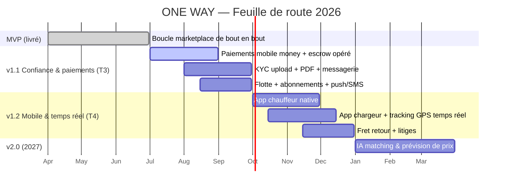

# ONE WAY — Roadmap produit

> État de référence : **MVP livré** (code présent dans ce dépôt). Jalons
> trimestriels 2026. ✅ livré · 🔭 prochain · 🛣️ planifié.

---

## 1. MVP livré (T2 2026) ✅

Le MVP couvre le **cœur de la boucle marketplace** de bout en bout : inscription → publication → matching/enchère → acceptation → suivi → livraison → notation, avec séquestre logique et tarification ancrée localement.

| Domaine | Livré |
|---------|-------|
| **Comptes & sessions** | Inscription `SHIPPER`/`CARRIER`, login/logout, `me`, JWT cookie 7 j, bcrypt. |
| **RBAC** | `requireUser` / `requireRole` (SHIPPER, CARRIER, DRIVER, ADMIN). |
| **Tarification** | Moteur de prix complet (`computeQuote`), devis public, estimation d'itinéraire. |
| **Catalogue** | 10 classes de véhicules, 8 types de marchandises + coefficients, surcharges situationnelles. |
| **Publication de fret** | Création (`OW-XXXX`), prix fixe/enchère, urgence, photos, valeur déclarée, génération devis. |
| **Marketplace** | Feed transporteur, filtres, **matching intelligent** (score note/proximité/prix/premium). |
| **Enchères / offres** | Placement & mise à jour d'offre, listing trié, acceptation. |
| **Exécution** | Création d'expédition (`EXP-XXXX`), machine à états de suivi, événements, position simulée. |
| **Séquestre (logique)** | Transaction `ESCROW` → `RELEASED`, commission figée (8 %/12 %). |
| **Documents (données)** | `QUOTE`, `BL`, `INVOICE`, `POD` générés aux jalons. |
| **Notation** | Avis bilatéraux post-livraison, recalcul de la note moyenne. |
| **Notifications** | In-app (offre, mission, suivi), lecture. |
| **Admin** | Validation/rejet KYC + synchro du statut utilisateur. |
| **Géo** | Gazetteer Madagascar, routes inter-villes réelles, carte SVG embarquée. |

### Hors-périmètre MVP (assumé)
Paiements réels (PSP), app mobile native, PDF téléchargeables, messagerie, CRUD flotte, IA, multi-devise.

---

## 2. v1.1 — « Confiance & transactions réelles » (T3 2026) 🔭

Thème : **rendre les transactions réelles et fluidifier l'exploitation**.

| Thème | Fonctionnalités |
|-------|-----------------|
| **Paiements réels** | Intégration **MVola, Orange Money, Airtel Money, Wave** ; intentions de paiement, webhooks signés/idempotents ; séquestre opéré (acompte 50 %, libération à la POD). |
| **KYC complet** | Upload de pièces (S3), file de validation admin, statuts synchronisés, badges « vérifié ». |
| **Documents PDF** | Rendu téléchargeable des devis, BL, factures, POD ; envoi email. |
| **Messagerie** | Chat chargeur ⇄ transporteur par fil (`/api/messages`), notifications. |
| **Gestion de flotte** | CRUD véhicules & chauffeurs, affectation de mission, statuts chauffeur. |
| **Abonnements** | Souscription `CARRIER_PRO` / `SHIPPER_BUSINESS`, bascule Premium, facturation récurrente. |
| **Push & SMS** | FCM (mobile), OTP & alertes SMS (Twilio/agrégateur local), code de suivi par SMS. |
| **Tracking public** | Page de suivi par `trackingCode` partageable au client final. |

---

## 3. v1.2 — « App mobile & temps réel » (T4 2026) 🛣️

Thème : **mobile-first natif et tracking GPS réel**.

| Thème | Fonctionnalités |
|-------|-----------------|
| **App chauffeur native** | React Native / Expo : mission du jour, navigation, boutons de statut, POD photo offline-first. |
| **App chargeur mobile** | Publication, offres, suivi live, paiement mobile money. |
| **Tracking GPS temps réel** | Ingestion GPS, WebSocket/SSE, géométrie d'itinéraire réelle (Mapbox/Google). |
| **Optimisation retour à vide** | Suggestions de fret retour aux transporteurs (réduction du « one way »). |
| **Litiges & support** | Workflow de litige, remboursement (`REFUNDED`), back-office support. |

---

## 4. v2.0 — « Intelligence & expansion » (2027) 🛣️

Thème : **IA, nouveaux revenus, multi-pays**.

| Thème | Fonctionnalités |
|-------|-----------------|
| **IA de matching** | Scoring appris (au-delà de la formule actuelle), prédiction d'acceptation, anti-fraude. |
| **Prévision de prix** | Recommandation dynamique de prix/budget par corridor, saison, demande. |
| **Assurance intégrée** | Souscription en ligne, partenaires assureurs, sinistres. |
| **Financement / avance** | Avance de trésorerie au transporteur (paiement anticipé contre frais). |
| **Enchères inversées** | Enchères à durée limitée, attribution automatique au meilleur score. |
| **Multi-pays / multi-devise** | Maghreb & Europe, devises locales, partitionnement géographique, conformité par pays. |
| **Intégrations ERP/TMS** | API publique, connecteurs (SAP, Odoo, TMS), webhooks partenaires. |
| **Programme fidélité** | Récompenses chargeurs/transporteurs, parrainage. |

---

## 5. Jalons trimestriels 2026

| Trimestre | Jalon clé | Objectif business |
|-----------|-----------|-------------------|
| **T2 2026** | MVP de bout en bout ✅ | Valider la boucle produit, premiers pilotes corridor Tana–Toamasina. |
| **T3 2026** | Paiements réels + KYC + abonnements | Premières transactions monétisées, take rate effectif, premiers abonnés Pro/Business. |
| **T4 2026** | App mobile + tracking GPS réel | Adoption terrain transporteurs/chauffeurs, NPS, rétention. |
| **2027** | IA + multi-pays | Optimisation des marges, début d'expansion régionale. |

---

## 6. Critères de passage de jalon (Definition of Done)

- **v1.1** : un chargeur peut payer en mobile money, les fonds sont séquestrés puis libérés à la POD ; un transporteur peut être vérifié (KYC) et s'abonner Pro (commission 8 %).
- **v1.2** : un chauffeur exécute une mission de bout en bout depuis l'app native, avec position GPS réelle visible par le chargeur.
- **v2.0** : le matching et la recommandation de prix s'appuient sur des modèles, et une 2ᵉ géographie/devise est ouverte.

> Voir `08-monetisation-kpis.md` pour les KPI de pilotage de chaque jalon.
